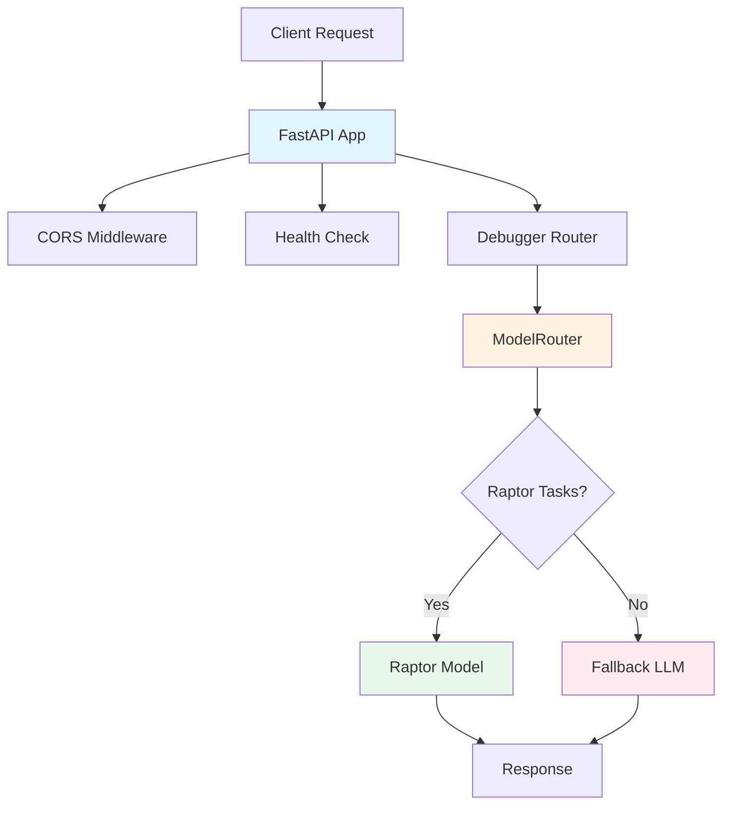

# GoblinOS Assistant

A comprehensive AI-powered development assistant built with FastAPI, featuring intelligent model routing and specialized debugging capabilities.

## Overview

GoblinOS Assistant is a comprehensive AI-powered development assistant with multiple components working together to provide intelligent software development support. It features intelligent model routing that automatically selects the most appropriate AI model based on task complexity, ensuring optimal performance and cost efficiency.

## Components

### 🏗️ Backend API (`backend/`)

- **Framework**: FastAPI (Python)
- **Purpose**: Main API service handling AI processing and development assistance
Note: Most backend-specific documentation has been consolidated under the canonical backend repository folder at `apps/goblin-assistant/backend/docs` (e.g. endpoint audits, monitoring, production quick-starts). See that folder for the canonical docs.

- **Features**: Intelligent model routing, debugging tools, error analysis, code suggestions

### 🎨 Frontend UI (`src/`)

- **Framework**: React + Vite (TypeScript)
- **Purpose**: User interface for interacting with the AI assistant
- **Features**: Web-based interface for development tasks and AI interactions

### 🛠️ Infrastructure (`infra/` + `goblin-infra/`)

- **Tools**: Terraform, Cloudflare Workers, Docker
- **Purpose**: Deployment, hosting, and scaling infrastructure
- **Environments**: Dev, staging, production with automated CI/CD via CircleCI

### 💾 Database & API Layer (`api/`, database files)

- **Database**: SQLite (`goblin_assistant.db`)
- **Purpose**: Data persistence, user sessions, and API routing
- **Features**: SQLAlchemy integration, database migrations

### 📊 Monitoring & Observability (`datadog/`)

- **Tools**: Datadog integration
- **Purpose**: Application monitoring, performance tracking, and alerting
- **Features**: Real-time metrics, error tracking, and health monitoring

## Features

### 🤖 Intelligent Model Routing

- **Smart Task Classification**: Automatically routes tasks to appropriate AI models
- **Raptor Integration**: Low-latency responses for routine debugging tasks
- **Fallback Support**: Complex reasoning tasks route to more capable LLMs
- **Cost Optimization**: Efficient model selection based on task requirements

### 🔧 AI-Powered Debugging

- **Error Analysis**: Intelligent error trace summarization
- **Code Suggestions**: Quick fixes and refactoring recommendations
- **Unit Test Generation**: Automated test case suggestions
- **Function Inference**: Smart function naming from code patterns

### 🚀 Production-Ready Architecture

- **FastAPI Framework**: High-performance async API with automatic OpenAPI docs
- **CORS Support**: Configurable cross-origin resource sharing
- **Health Monitoring**: Built-in health check endpoints
- **Environment Configuration**: Secure credential management

## Quick Start

### Prerequisites

- Python 3.11+
- pip (Python package manager)

### Installation

1. **Clone the repository**:

   ```bash
   git clone https://github.com/fuaadabdullah/forgemono.git
   cd forgemono/apps/goblin-assistant
   ```

2. **Install dependencies**:

   ```bash
   pip install fastapi uvicorn httpx pytest
   ```

3. **Configure environment**:

   **Option A: Bitwarden Vault (Recommended)**

   ```bash
   # Install Bitwarden CLI
   npm install -g @bitwarden/cli

   # Login and setup vault (one-time)
   bw login YOUR_EMAIL
   export BW_SESSION=$(bw unlock --raw)

   # Load development secrets
   source scripts/load_env.sh

   # Verify secrets loaded
   echo $FASTAPI_SECRET
   ```

   See [Bitwarden Vault Setup](./docs/BITWARDEN_VAULT_SETUP.md) for complete vault configuration.

   **Option B: Manual .env (Development Only)**

   ```bash
   cp backend/.env.example backend/.env.local
   # Edit .env.local with your actual values
   ```

4. **Run the server**:

   ```bash
   uvicorn backend.main:app --reload --port 8000
   ```

5. **Verify installation**:

   ```bash
   curl http://localhost:8000/health
   ```

## API Documentation

### Core Endpoints

#### Health Check

```http
GET /health
```

Response:

```json
{
  "status": "healthy"
}
```

#### Root Endpoint

```http
GET /
```

Response:

```json
{
  "message": "GoblinOS Assistant Backend API"
}
```

### Debugging Endpoints

The assistant provides specialized debugging capabilities through the `/debugger` endpoints. See [Debugger Documentation](./README_DEBUGGER.md) for detailed API specifications.

## Configuration

### Environment Variables

Create a `.env.local` file in the `backend/` directory:

```bash
# Raptor model configuration (for quick debug tasks)
RAPTOR_URL=https://your-raptor-endpoint/api
RAPTOR_API_KEY=your-raptor-api-key

# Fallback model configuration (existing LLM)
FALLBACK_MODEL_URL=https://your-llm-endpoint/api
FALLBACK_MODEL_KEY=your-llm-api-key
```

### Security Notes

- Never commit `.env.local` files to version control
- Use strong, unique API keys for each service
- **Recommended**: Use Bitwarden vault for secrets management (see [Bitwarden Vault Setup](./docs/BITWARDEN_VAULT_SETUP.md))
- Consider using a secrets management service in production
- Rotate API keys regularly

### Production Hardening & Checklist

The following items are recommended before deploying to production. The app is usable in development without them, but production deployments should follow these steps to ensure security and reliability.

- Use a managed secrets store (Vault, AWS Secrets Manager, Azure KeyVault) for provider API keys instead of file-based storage (e.g., `backend/api_keys.json`). If you store API keys in your database, make sure they're encrypted (see `backend/services/encryption.py`) and access-controlled.
- Enable `USE_REDIS_CHALLENGES=true` and configure Redis for passkey challenge storage (recommended in `backend/PRODUCTION_DEPLOYMENT_GUIDE.md`).
- Use Redis (or similar) for rate limiting and task queues (RQ). The in-memory rate limiter is intended for local development and won't scale across instances.
- Ensure `ROUTING_ENCRYPTION_KEY` is configured and protected — it's used for decrypting provider API keys stored in DB.
- Run `ProviderProbeWorker` (or enable routing probe worker) in a background worker to continuously monitor provider health and gather metrics.
- Disable any debug endpoints or routes (e.g., local-llm-proxy admin endpoints) in production and ensure proper API key validation for local proxies.
- Configure Prometheus to scrape `/metrics` and set up alerts on provider health, error rates, and request latency.
- Set up a log aggregation pipeline (Datadog/ELK/CloudWatch) and ensure logs do not capture raw secret values. Configure structured logging (`X-Correlation-ID`) for traceability.
- Use a distributed session/store for `task_queue` (Redis) and ensure backups for persistent data (Postgres or backups of SQLite if used temporarily).
- Implement a secrets rotation policy and an automated process for rotating encryption keys and API keys.

### Frontend Security Checklist

- Ensure no secrets are exposed via `VITE_` variables (client `VITE_` envs are public). Move secrets to the backend / secrets manager.
- Use HttpOnly, Secure cookies for session/JWT tokens instead of localStorage to reduce XSS risks.
- Authenticate streaming endpoints using cookies or short-lived signed stream tokens; do not put secrets into URL query strings.
- Add a CSP and sanitize any HTML rendered from model output to prevent XSS.
- Configure CORS to allow only the specific production frontend domains (do not use `*` in production).

## Development

### Project Structure

```text
apps/goblin-assistant/
├── backend/
│   ├── __pycache__/
│   ├── debugger/
│   │   ├── model_router.py    # Intelligent model routing logic
│   │   └── router.py          # FastAPI debugger endpoints
│   ├── main.py                # FastAPI application setup
│   └── .env.example           # Environment configuration template
├── tests/
│   └── test_model_router.py   # Unit tests for model routing
├── test_debugger.py           # Integration test script
└── README_DEBUGGER.md         # Detailed debugger documentation
```

### Running Tests

#### Unit Tests

```bash
python -m pytest tests/ -v
```

#### Integration Tests

```bash
python test_debugger.py
```

#### All Tests

```bash
python -m pytest tests/ && python test_debugger.py
```

### Development Server

```bash
# With auto-reload for development
uvicorn backend.main:app --reload --port 8000

# Production deployment
uvicorn backend.main:app --host 0.0.0.0 --port 8000
```

## Architecture



### Key Components

- **FastAPI Application**: Main web framework handling HTTP requests
- **ModelRouter**: Intelligent routing logic based on task type and complexity
- **Debugger Router**: Specialized endpoints for debugging assistance
- **Environment Config**: Secure credential and endpoint management

## Deployment

### Production Pipeline (Recommended)

The **villain-level production pipeline** combines Bitwarden CLI, CircleCI, and Fly.io for automated, secure deployments:

- **Bitwarden Vault**: All secrets stored securely
- **CircleCI**: Automated CI/CD on every push to main
- **Fly.io**: Production hosting with zero-downtime deploys

**Setup**: See [Production Pipeline Guide](./docs/PRODUCTION_PIPELINE.md)

**Quick Deploy**: Push to `main` branch → Automatic production deployment

### Manual Deployment Options

#### Fly.io Manual Deploy

For testing or emergency deployments:

```bash
# Load production secrets from Bitwarden
source scripts/load_env.sh

# Deploy to Fly.io
./deploy-fly.sh
```

#### Local Development

```bash
# Install dependencies
pip install -r requirements.txt

# Run with uvicorn
uvicorn backend.main:app --reload
```

#### Docker Deployment

```dockerfile
FROM python:3.11-slim

WORKDIR /app
COPY requirements.txt .
RUN pip install -r requirements.txt

COPY . .
EXPOSE 8000

CMD ["uvicorn", "backend.main:app", "--host", "0.0.0.0", "--port", "8000"]
```

### Production Considerations

- Use a reverse proxy (nginx/Caddy) for SSL termination
- Implement rate limiting and request throttling
- Set up monitoring and logging
- Use environment-specific configuration
- Consider container orchestration (Docker Compose/Kubernetes)

## Contributing

### Development Guidelines

1. Follow PEP 8 style guidelines
2. Write comprehensive unit tests
3. Update documentation for API changes
4. Use meaningful commit messages
5. Test integration endpoints thoroughly

### Adding New Features

1. Create feature branch from `main`
2. Implement changes with tests
3. Update relevant documentation
4. Submit pull request with description

## Troubleshooting

### Common Issues

**Import Errors**: Ensure you're running from the correct directory:

```bash
cd apps/goblin-assistant
```

**Environment Variables**: Verify `.env.local` exists and contains valid keys:

```bash
ls -la backend/.env.local
```

**Port Conflicts**: Change the default port if 8000 is in use:

```bash
uvicorn backend.main:app --port 8001
```

### Debug Mode

Enable detailed logging:

```bash
export PYTHONPATH=/Users/fuaadabdullah/ForgeMonorepo/apps/goblin-assistant
python -c "import logging; logging.basicConfig(level=logging.DEBUG)"
```

## Related Documentation

- [Debugger API Documentation](./README_DEBUGGER.md) - Detailed debugger endpoint specifications
- [ForgeMonorepo Documentation](../../docs/WORKSPACE_OVERVIEW.md) - Overall project structure
- [GoblinOS Guilds](../../GoblinOS/docs/ROLES.md) - Team roles and responsibilities

## License

This project is part of the ForgeMonorepo and follows the same licensing terms.

## Support

For issues and questions:

1. Check existing documentation
2. Review test cases for usage examples
3. Create an issue in the ForgeMonorepo repository
4. Contact the development team through GoblinOS channels

---

**Last Updated**: November 25, 2025
**Version**: 1.0.0
