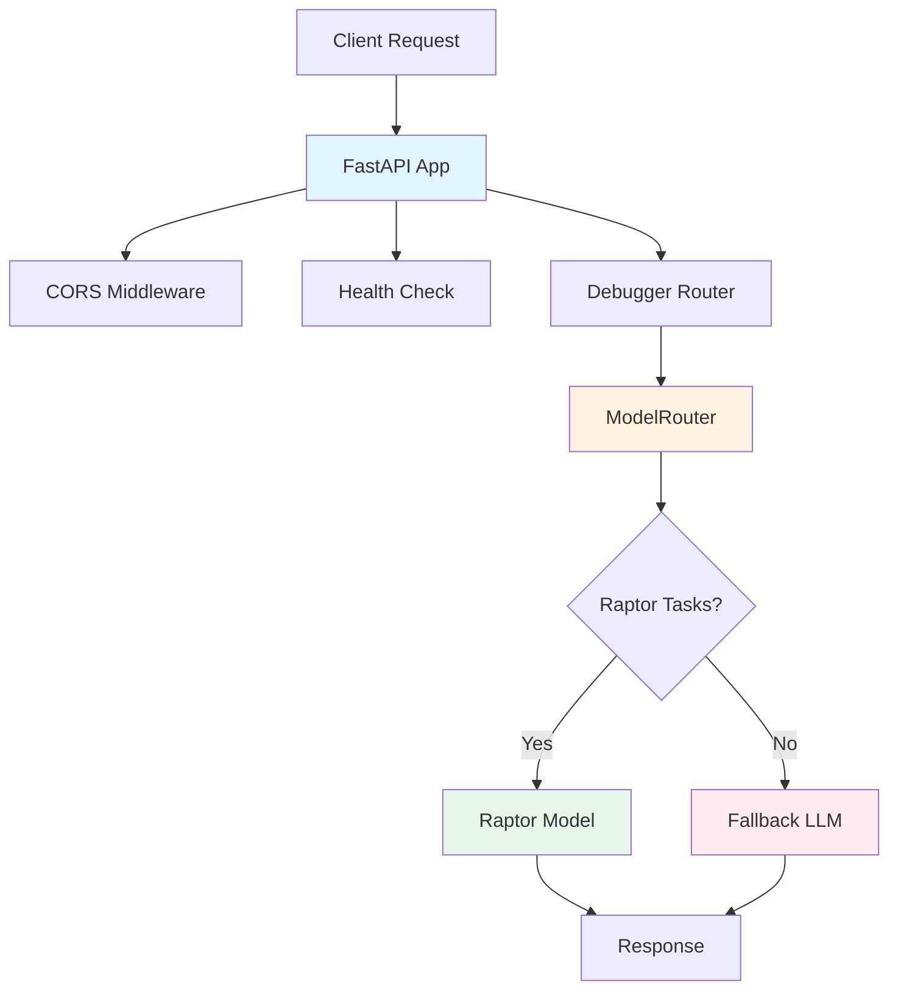

# GoblinOS Assistant

A comprehensive AI-powered development assistant built with FastAPI, featuring intelligent model routing and specialized debugging capabilities.

## Overview

GoblinOS Assistant is a backend API service that provides AI-powered assistance for software development tasks. It features intelligent model routing that automatically selects the most appropriate AI model based on task complexity, ensuring optimal performance and cost efficiency.

## Features

### 🤖 Intelligent Model Routing

- **Smart Task Classification**: Automatically routes tasks to appropriate AI models
- **Raptor Integration**: Low-latency responses for routine debugging tasks
- **Fallback Support**: Complex reasoning tasks route to more capable LLMs
- **Cost Optimization**: Efficient model selection based on task requirements

### 🔧 AI-Powered Debugging

- **Error Analysis**: Intelligent error trace summarization
- **Code Suggestions**: Quick fixes and refactoring recommendations
- **Unit Test Generation**: Automated test case suggestions
- **Function Inference**: Smart function naming from code patterns

### 🚀 Production-Ready Architecture

- **FastAPI Framework**: High-performance async API with automatic OpenAPI docs
- **CORS Support**: Configurable cross-origin resource sharing
- **Health Monitoring**: Built-in health check endpoints
- **Environment Configuration**: Secure credential management

## Quick Start

### Prerequisites

- Python 3.11+
- pip (Python package manager)

### Installation

1. **Clone the repository**:

   ```bash
   git clone https://github.com/fuaadabdullah/forgemono.git
   cd forgemono/apps/goblin-assistant
   ```

2. **Install dependencies**:

   ```bash
   pip install fastapi uvicorn httpx pytest
   ```

3. **Configure environment**:

   ```bash
   cp backend/.env.example backend/.env.local
   # Edit .env.local with your actual values
   ```

4. **Run the server**:

   ```bash
   uvicorn backend.main:app --reload --port 8000
   ```

5. **Verify installation**:

   ```bash
   curl http://localhost:8000/health
   ```

## API Documentation

### Core Endpoints

#### Health Check

```http
GET /health
```

Response:

```json
{
  "status": "healthy"
}
```

#### Root Endpoint

```http
GET /
```

Response:

```json
{
  "message": "GoblinOS Assistant Backend API"
}
```

### Debugging Endpoints

The assistant provides specialized debugging capabilities through the `/debugger` endpoints. See [Debugger Documentation](./README_DEBUGGER.md) for detailed API specifications.

## Configuration

### Environment Variables

Create a `.env.local` file in the `backend/` directory:

```bash
# Raptor model configuration (for quick debug tasks)
RAPTOR_URL=https://your-raptor-endpoint/api
RAPTOR_API_KEY=your-raptor-api-key

# Fallback model configuration (existing LLM)
FALLBACK_MODEL_URL=https://your-llm-endpoint/api
FALLBACK_MODEL_KEY=your-llm-api-key
```

### Security Notes

- Never commit `.env.local` files to version control
- Use strong, unique API keys for each service
- Consider using a secrets management service in production
- Rotate API keys regularly

## Development

### Project Structure

```text
apps/goblin-assistant/
├── backend/
│   ├── __pycache__/
│   ├── debugger/
│   │   ├── model_router.py    # Intelligent model routing logic
│   │   └── router.py          # FastAPI debugger endpoints
│   ├── main.py                # FastAPI application setup
│   └── .env.example           # Environment configuration template
├── tests/
│   └── test_model_router.py   # Unit tests for model routing
├── test_debugger.py           # Integration test script
└── README_DEBUGGER.md         # Detailed debugger documentation
```

### Running Tests

#### Unit Tests

```bash
python -m pytest tests/ -v
```

#### Integration Tests

```bash
python test_debugger.py
```

#### All Tests

```bash
python -m pytest tests/ && python test_debugger.py
```

### Development Server

```bash
# With auto-reload for development
uvicorn backend.main:app --reload --port 8000

# Production deployment
uvicorn backend.main:app --host 0.0.0.0 --port 8000
```

## Architecture



### Key Components

- **FastAPI Application**: Main web framework handling HTTP requests
- **ModelRouter**: Intelligent routing logic based on task type and complexity
- **Debugger Router**: Specialized endpoints for debugging assistance
- **Environment Config**: Secure credential and endpoint management

## Deployment

### Local Development

```bash
# Install dependencies
pip install -r requirements.txt

# Run with uvicorn
uvicorn backend.main:app --reload
```

### Docker Deployment

```dockerfile
FROM python:3.11-slim

WORKDIR /app
COPY requirements.txt .
RUN pip install -r requirements.txt

COPY . .
EXPOSE 8000

CMD ["uvicorn", "backend.main:app", "--host", "0.0.0.0", "--port", "8000"]
```

### Production Considerations

- Use a reverse proxy (nginx/Caddy) for SSL termination
- Implement rate limiting and request throttling
- Set up monitoring and logging
- Use environment-specific configuration
- Consider container orchestration (Docker Compose/Kubernetes)

## Contributing

### Development Guidelines

1. Follow PEP 8 style guidelines
2. Write comprehensive unit tests
3. Update documentation for API changes
4. Use meaningful commit messages
5. Test integration endpoints thoroughly

### Adding New Features

1. Create feature branch from `main`
2. Implement changes with tests
3. Update relevant documentation
4. Submit pull request with description

## Troubleshooting

### Common Issues

**Import Errors**: Ensure you're running from the correct directory:

```bash
cd apps/goblin-assistant
```

**Environment Variables**: Verify `.env.local` exists and contains valid keys:

```bash
ls -la backend/.env.local
```

**Port Conflicts**: Change the default port if 8000 is in use:

```bash
uvicorn backend.main:app --port 8001
```

### Debug Mode

Enable detailed logging:

```bash
export PYTHONPATH=/Users/fuaadabdullah/ForgeMonorepo/apps/goblin-assistant
python -c "import logging; logging.basicConfig(level=logging.DEBUG)"
```

## Related Documentation

- [Debugger API Documentation](./README_DEBUGGER.md) - Detailed debugger endpoint specifications
- [ForgeMonorepo Documentation](../../docs/WORKSPACE_OVERVIEW.md) - Overall project structure
- [GoblinOS Guilds](../../GoblinOS/docs/ROLES.md) - Team roles and responsibilities

## License

This project is part of the ForgeMonorepo and follows the same licensing terms.

## Support

For issues and questions:

1. Check existing documentation
2. Review test cases for usage examples
3. Create an issue in the ForgeMonorepo repository
4. Contact the development team through GoblinOS channels

---

**Last Updated**: November 25, 2025
**Version**: 1.0.0
