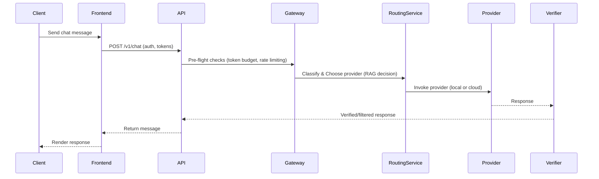

# Request Routing Sequence

This diagram shows the core request routing sequence from the user to the AI provider and back, including gateway checks and verification.

Notes:

- Replace `Provider` in the diagram with `Ollama`, `OpenAI`, `Anthropic`, etc. when you want provider-specific flows.

