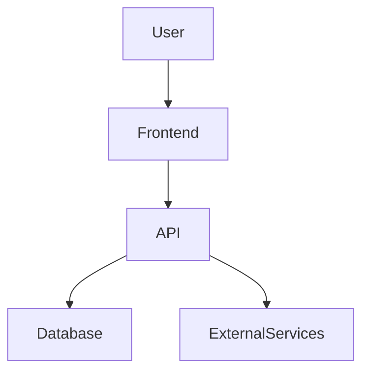

# Workspace Overview

This monorepo contains GoblinOS (primary platform), infra tooling, utilities, and demo/portfolio projects.

## Structure

- `apps/` — Active polyglot applications and projects (Python, Node.js, etc.)
- `GoblinOS/` — TypeScript/pnpm workspace for the Goblin platform, agents, and automation.
- `infra/` — Devcontainer, docker-compose, and deployment scaffolding.
- `tools/` — Dev scripts, release helpers, TUIs.
- `portfolio/` — Personal docs/assets (resume, project notes).
- `artifacts/` — Generated files (reports, SARIF, etc.).
- `apps/forge-lite/` — Contains the UI logic for Forge Lite.
- `backend/` — Centralized backend scripts and configurations.
- `docs/backend/` — Documentation related to backend architecture and API keys.
- `shared/` — Shared utilities and TypeScript types used across the repository.

## Conventions

- Node: pnpm + Node 20/22. Run commands within `GoblinOS/`.
- Python: Use venvs per project. Keep dependencies in `requirements.txt`.
- Naming: Future refactors will normalize folder names; avoid spaces in new folders.
- Ownership: See `CODEOWNERS`.

## Nested Git Repos

Some demo directories may contain a nested `.git` (legacy import). These can confuse tooling. Prefer:

1. Promote to a proper package in `GoblinOS/packages/` (Node) or a top-level `apps/` dir (Python), or
2. Convert to a formal git submodule if it must remain independent.

Propose changes via PR before moving directories.

## Getting Started (GoblinOS)

```bash
cd GoblinOS
pnpm install
pnpm build
pnpm test
```

For AI features (Ollama) and more, see `GoblinOS/README.md`.

## KPI test helpers (bridge)

The Overmind bridge package (`packages/goblins/overmind/bridge`) exposes a small in-memory mock KPI store when tests run with `OVERMIND_MOCK=1`. This is useful for asserting that KPI events and tool invocations are recorded during integration tests.

Key helpers (available in the bridge test harness):

- `kpiStore.getRecordedEvents()` — returns recorded KPI events (with timestamps).
- `kpiStore.getRecordedToolInvocations()` — returns recorded tool invocation records.
- `kpiStore.clear()` — clear recorded events (useful in `beforeEach`).

See `packages/goblins/overmind/bridge/README.md` for a short example test snippet showing usage.

## Actionable Guides

### How to Deploy Locally

See `docs/backend/API_KEYS_STATUS.md` for step-by-step instructions. Troubleshooting tips:

- If you see a `virtualenv` error, ensure Python and virtualenv are installed.
- For missing environment variables, copy `.env.example` to `.env` and fill in secrets.
- For permission errors, try `chmod +x scripts/*`.

### How to Add a New Goblin

See `docs/backend/API_KEYS_STATUS.md`. Checklist:

- [ ] Add goblin to `GoblinOS/goblins.yaml`
- [ ] Run `cd GoblinOS && node scripts/generate-roles.js`
- [ ] Confirm in `docs/ROLES.md`
- [ ] Add tests and update docs
- [ ] Request code review

### How to Run Tests

- **Unit tests:**
  - Node: `cd GoblinOS && pnpm test`
  - Python: `pytest` in the relevant app directory
- **E2E tests:**
  - See `tools/forge-lite-e2e-test` or project-specific scripts
- **Coverage:**
  - Node: `pnpm test -- --coverage`
  - Python: `pytest --cov`

### How to Contribute Documentation

- Write in Markdown (`.md`)
- Place docs in the relevant `docs/` subfolder
- Follow the style in `docs/development/CONTRIBUTING.md`
- Submit a PR for review

### Support / Contact

- For help, open an issue or email `goblinosrep@gmail.com`
- See `docs/development/CONTRIBUTING.md` for more support channels

### Error Handling Strategy (Example)

- **Bash:**

  ```bash

  set -e
  trap 'echo "Error on line $LINENO"' ERR
  ```

- **Python:**

  ```python
  try:
      # code
  except Exception as e:
      print(f"Error: {e}")
      exit(1)
  ```

### Data Flow Diagram

See `docs/backend/DATA_FLOW_DIAGRAM.md` for the latest diagram. Example (Mermaid):



## Active Projects

- GoblinOS Assistant

## Operations & Security Docs

- Vault Integration: `docs/vault_integration.md` (dev/prod setup, rotation, API examples)
- Secrets handling: `docs/SECRETS_HANDLING.md`
- Observability & SLOs: `docs/observability/DATADOG_SLOS.md`
- Runbook: `docs/observability/runbook.md`
- Release checklist: `docs/RELEASE_CHECKLIST.md`
