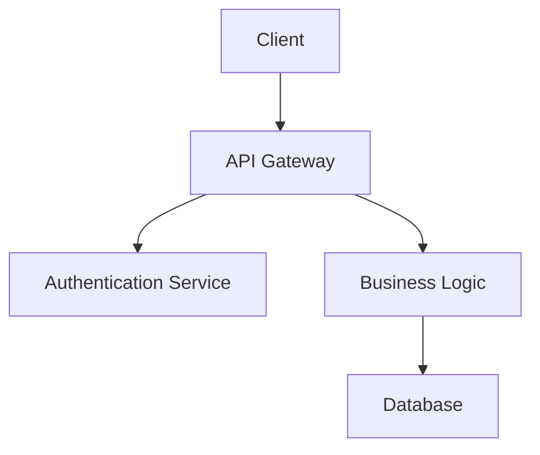

# Documentation System

The ForgeMonorepo includes a comprehensive documentation pipeline with AI-powered quality analysis, automatic diagram generation, and continuous integration validation.

## Overview

The documentation system provides:

- **Standardized Templates**: Frontmatter-based document structure with consistent metadata
- **AI Quality Analysis**: Automated scoring and improvement suggestions using Raptor Mini
- **Automatic Diagrams**: Mermaid diagram extraction and rendering from code comments
- **CI/CD Validation**: Automated quality checks and validation in GitHub Actions
- **Resource Efficiency**: Uses Colab-deployed Raptor Mini instead of local Ollama

## Setup

### Prerequisites

```bash
# Python dependencies
pip install frontmatter click requests

# Node.js tools (global installation recommended)
npm install -g markdownlint-cli markdown-link-check prettier @mermaid-js/mermaid-cli
```

### Raptor Mini Configuration

The system uses a Colab-deployed Raptor Mini instance for AI analysis:

```bash
# Copy environment template
cp .env.example .env

# Edit .env with your Colab Raptor endpoint URL
# RAPTOR_MINI_URL=https://your-colab-endpoint.ngrok.io
```

## Usage

### Command Line Interface

The documentation system provides a comprehensive CLI tool:

```bash
# Create new document with template
python scripts/doc_cli.py new docs/my-feature.md --type feature

# Validate document structure and content
python scripts/doc_cli.py validate docs/my-feature.md

# Generate diagrams from code comments
python scripts/doc_cli.py diagrams apps/my-app/src/

# AI analysis with quality scoring
python scripts/doc_cli.py analyze docs/my-feature.md --url https://your-colab-endpoint.ngrok.io

# Full documentation audit
python scripts/doc_cli.py audit docs/
```

### Document Templates

#### Standard Frontmatter Structure

All documents use a consistent frontmatter structure:

```yaml
---
title: "Document Title"
description: "Brief description for SEO and previews"
author: "Author Name"
date: "2025-01-01"
tags: ["tag1", "tag2"]
category: "documentation"
status: "draft|review|published"
---

# Document Content
```

#### Document Types

- **feature**: Feature documentation with requirements, implementation, and testing
- **api**: API reference documentation
- **guide**: User or developer guides
- **architecture**: System architecture and design documents
- **tutorial**: Step-by-step tutorials

### Quality Analysis

The AI analysis provides:

- **Clarity Score**: How clear and understandable the content is
- **Completeness Score**: Coverage of the documented topic
- **Structure Score**: Organization and formatting quality
- **Accuracy Score**: Technical correctness
- **Readability Score**: Language and accessibility

#### Analysis Output

```json
{
  "overall_score": 85,
  "clarity": 88,
  "completeness": 82,
  "structure": 90,
  "accuracy": 86,
  "readability": 84,
  "suggestions": [
    "Consider adding code examples for the API endpoints",
    "The troubleshooting section could be more detailed"
  ]
}
```

## Diagram Generation

### Automatic Diagram Extraction

The system can automatically generate diagrams from code comments:

```python
# @diagram flowchart
# A[Start] --> B{Decision}
# B -->|Yes| C[Action 1]
# B -->|No| D[Action 2]
# C --> E[End]
# D --> E
def my_function():
    pass
```

### Supported Diagram Types

- **Flowcharts**: Process flows and decision trees
- **Sequence Diagrams**: Interaction sequences between components
- **Class Diagrams**: Object-oriented design documentation
- **Entity Relationship**: Database schema visualization
- **State Diagrams**: State machine documentation

### Manual Diagram Creation

You can also create diagrams manually using Mermaid syntax:



## CI/CD Integration

### GitHub Actions Validation

The documentation system integrates with CI/CD for automated validation:

```yaml
# .github/workflows/docs-validation.yml
name: Documentation Validation
on:
  pull_request:
    paths:
      - 'docs/**'
      - 'apps/*/docs/**'

jobs:
  validate:
    runs-on: ubuntu-latest
    steps:
      - uses: actions/checkout@v3
      - name: Validate Documentation
        run: python scripts/doc_cli.py audit docs/
```

### Quality Gates

- **Markdown Linting**: Ensures consistent formatting
- **Link Checking**: Validates all internal and external links
- **Quality Scoring**: Minimum quality thresholds for documentation
- **Template Compliance**: Ensures proper frontmatter and structure

## Best Practices

### Document Organization

```text
docs/
├── README.md                 # Documentation index
├── getting-started.md       # Quick start guide
├── architecture/            # System architecture docs
│   ├── overview.md
│   └── components/
├── api/                     # API documentation
│   ├── v1/
│   └── migration-guides/
├── guides/                  # User and developer guides
└── templates/               # Document templates
```

### Writing Guidelines

#### Frontmatter Standards

- Always include `title`, `description`, and `date`
- Use relevant `tags` for discoverability
- Set appropriate `status` for document lifecycle
- Include `author` for attribution

#### Content Standards

- Use clear, concise language
- Include code examples where helpful
- Provide troubleshooting sections
- Link to related documentation
- Keep documents focused on single topics

#### Code Examples

```typescript
// Good: Include language identifier and comments
function exampleFunction(param: string): boolean {
  // Validate input
  if (!param) return false;

  // Process and return result
  return param.length > 0;
}
```

### Maintenance

#### Regular Audits

```bash
# Monthly documentation audit
python scripts/doc_cli.py audit docs/ --report audit-report.json

# Check for outdated links
python scripts/doc_cli.py links docs/

# Update AI analysis scores
python scripts/doc_cli.py analyze docs/ --batch
```

#### Quality Monitoring

- Track documentation quality scores over time
- Monitor link rot and broken references
- Review user feedback and update accordingly
- Archive deprecated documents appropriately

## Advanced Features

### Custom Templates

Create custom document templates for specific use cases:

```python
# scripts/templates/custom-template.py
TEMPLATE = """---
title: "{title}"
description: "{description}"
type: "custom"
---

# {title}

## Overview

{description}

## Implementation

<!-- Implementation details -->

## Testing

<!-- Testing approach -->
"""
```

### Integration with Development Workflow

#### Pre-commit Hooks

```bash
# .pre-commit-config.yaml
repos:
  - repo: local
    hooks:
      - id: validate-docs
        name: Validate documentation
        entry: python scripts/doc_cli.py validate
        files: ^docs/
        pass_filenames: false
```

#### IDE Integration

The documentation system can integrate with IDEs for:

- Real-time quality analysis
- Template autocompletion
- Link validation
- Diagram preview

### Analytics and Insights

Track documentation usage and effectiveness:

- Page view analytics
- Search query analysis
- User feedback collection
- Quality score trending
- Content gap identification

## Troubleshooting

### Common Issues

#### Raptor Mini Connection Issues

```bash
# Test Raptor Mini connectivity
curl -X POST https://your-endpoint.ngrok.io/analyze \
  -H "Content-Type: application/json" \
  -d '{"text": "test"}'
```

#### Diagram Generation Failures

- Check Mermaid syntax validity
- Ensure code comments use correct `@diagram` format
- Verify diagram type is supported

#### CI/CD Pipeline Failures

- Check markdown linting errors
- Validate all links are accessible
- Ensure minimum quality scores are met
- Review template compliance

### Debug Mode

Enable verbose logging for troubleshooting:

```bash
# Debug CLI operations
DEBUG=1 python scripts/doc_cli.py validate docs/my-doc.md

# Debug AI analysis
DEBUG=1 python scripts/doc_cli.py analyze docs/my-doc.md --debug
```

## Contributing

### Adding New Features

1. Create feature branch
2. Implement changes with tests
3. Update documentation
4. Submit pull request

### Template Development

When creating new document templates:

1. Define frontmatter schema
2. Create template file
3. Add validation logic
4. Update CLI commands
5. Document usage

### Quality Improvements

Contribute to quality analysis by:

1. Improving scoring algorithms
2. Adding new quality metrics
3. Enhancing suggestion generation
4. Expanding language support
